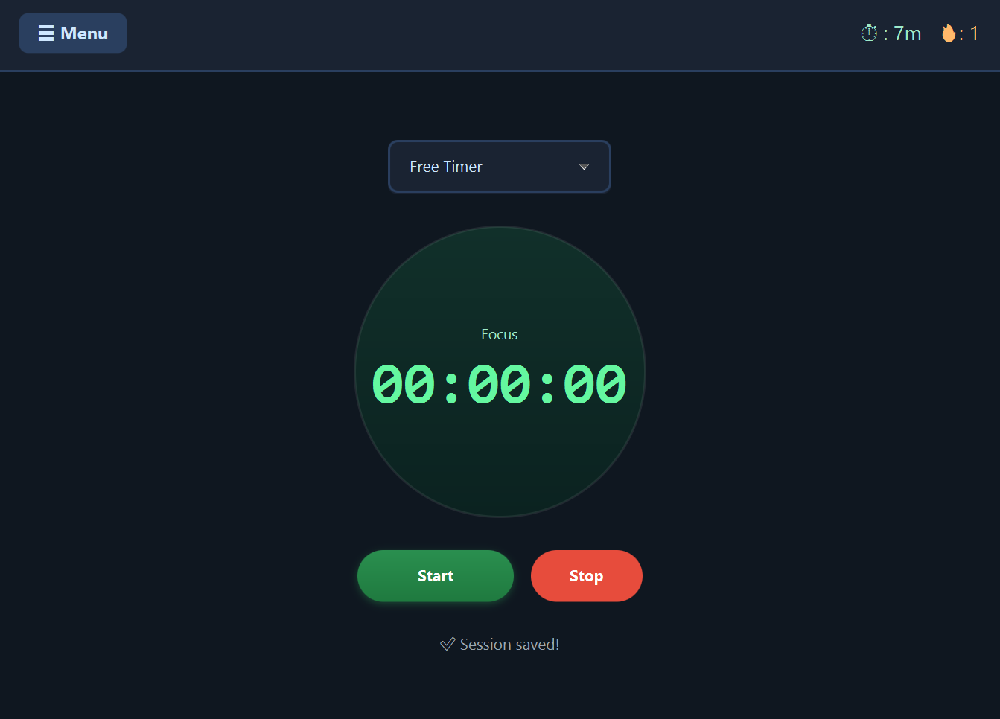
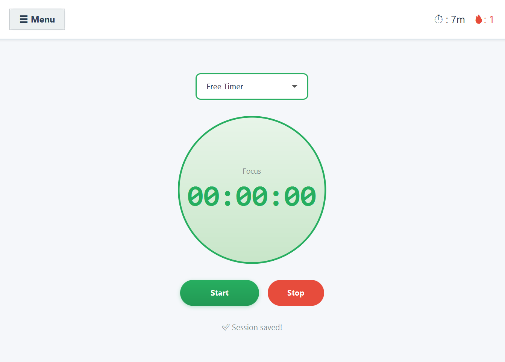
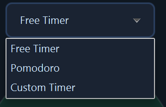
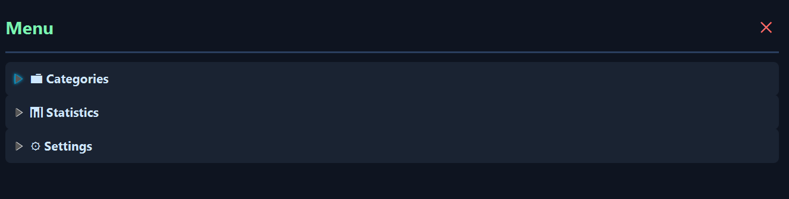
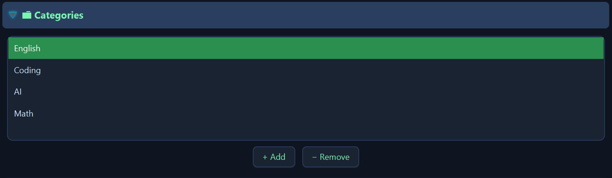
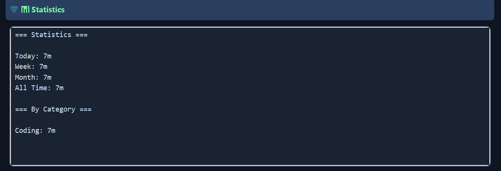

# Lablabu - Focus Timer

A Pomodoro and focus tracking application built with JavaFX.

## Features

### Timer Modes
- **Free Timer**: Counts up indefinitely - perfect for flexible work sessions
- **Pomodoro**: Classic 25-minute work sessions with 5-minute breaks
- **Custom Timer**: Set your own work and break durations (1-120 minutes for work, 1-60 minutes for breaks)

### Session Tracking
- Track focus time by category (English, Coding, AI, Math, or custom categories)
- Automatic session saving when timer completes naturally
- Manual save option (minimum 1 minute)
- View statistics by day, week, month, and all-time

### Statistics
- Daily streak tracking (🔥)
- Today's total focus time (⏱)
- Breakdown by category
- Week and month totals

### User Interface
- Light and dark themes
- Side menu with settings and statistics
- Sound notification when timer completes (ding.mp3)

## How to Use

### Starting a Session
1. Select a category from the list
2. Choose your timer mode (Free Timer, Pomodoro, or Custom Timer)
3. Click "Start" to begin focusing
4. The timer will show your progress
5. Click "Pause" to pause, or "Stop" to end and save the session

### Pomodoro Mode
- Work phase: 25 minutes of focused work
- Break phase: 5 minutes of rest
- Automatically switches between work and break
- Sessions are auto-saved when work phase completes

### Custom Timer
1. Select "Custom Timer" mode
2. Set your work duration (e.g., 30 minutes)
3. Set your break duration (e.g., 10 minutes)
4. Click "Apply" to save settings
5. Timer will alternate between work and break phases

### Managing Categories
- Click "Add Category" to create new categories
- Click "Remove Category" to delete selected category
- Categories help organize your focus sessions

### Viewing Statistics
- Open the side menu (☰ button)
- View today's time, streak, and category breakdowns
- Statistics update automatically after each session

## Screenshots

### Main Window Dark Theme


### Main Window Light Theme


### Timer Modes (Free, Pomodoro, Custom)


### Side Menu


### Categories Tab


### Statistics Tab


### Settings Tab


## Technical Details

### Project Structure
```
src/main/java/lablabu/
├── controller/
│   ├── MainController.java       # Simple timer view controller
│   └── TimerController.java      # Main app controller
├── model/
│   ├── AppState.java             # Application state and settings
│   ├── Category.java             # Category model
│   └── Session.java              # Session model
├── service/
│   ├── SoundService.java         # Audio playback (unused)
│   ├── StatsService.java         # Statistics calculations
│   ├── StorageService.java       # JSON persistence
│   └── TimerService.java         # Timer logic
├── Launcher.java                 # Entry point
└── Main.java                     # JavaFX Application

src/main/resources/lablabu/
├── main-view-v2.fxml             # Main UI layout
├── theme-dark.css                # Dark theme styles
├── theme-light.css               # Light theme styles
├── ding.mp3                      # Completion sound
└── beet.png                      # App icon
```

### Data Storage
- Sessions and settings are saved to `data.json` in the application directory
- Automatic migration from old data format
- Data persists between application restarts

### Timer Phases
- **Focus**: Work/study phase (label shows "Focus")
- **Break**: Rest phase (label shows "Break")
- Status line updates to show current activity

### Session Saving Rules
- Free Timer: Sessions saved when manually stopped (min 1 minute)
- Pomodoro/Custom: Work sessions auto-saved when phase completes naturally
- Break sessions are NOT saved (they're rest time)
- All sessions include category, duration, date, and timestamps

## Building and Running

### Requirements
- Java 17 or higher
- JavaFX 17+
- Maven (for building)

### Run from IDE
1. Open project in IntelliJ IDEA or Eclipse
2. Run `Launcher.java` main method

### Build JAR
```bash
mvn clean package
java -jar target/lablabu-1.0.jar
```

## Sound Effects
The application includes a ding sound (`ding.mp3`) that plays when:
- Pomodoro work phase completes
- Custom timer work phase completes
- Break phase completes

Sound does NOT play when:
- Manually stopping the timer
- Pausing the timer

## Themes
- **Dark Theme**: Default, easy on the eyes for long sessions
- **Light Theme**: Alternative bright theme
- Switch in the side menu settings
- Theme preference is saved and persists

## Tips
- Use categories to track different types of work
- Check your daily streak to maintain consistency
- Start with Pomodoro mode if new to time management
- Adjust Custom Timer for longer deep work sessions
- Review statistics weekly to see your progress

## Version
Current version: 1.0

## License
Educational project - free to use and modify
